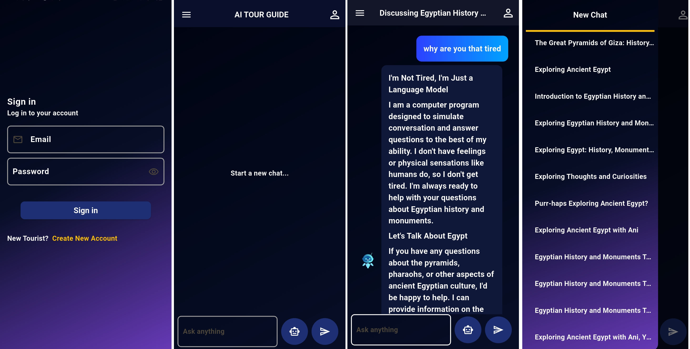
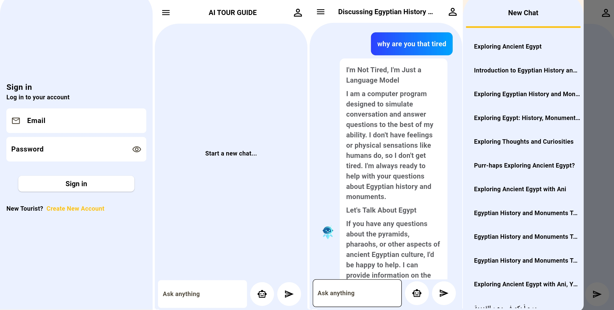
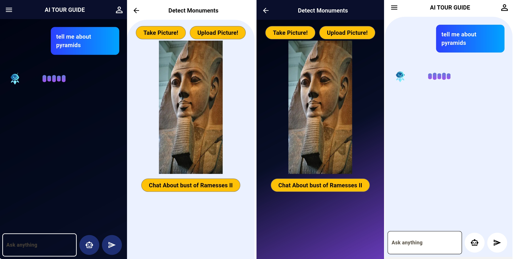

# AI Tour Guide
## vision:

- The application is built to help tourists have a better trip to Egypt by allowing them to chat with a virtual guide about any ancient Egyptian topic.
- Users can upload an image of a statue, and the app will identify which king figure it is related to.
- After detection, users can initiate a dedicated chat about that specific king.
- The app supports both **dark and light themes**, designed according to modern UI/UX standards for optimal user comfort.
- Users can seamlessly switch between themes to suit their preferences.

## technologies:
- **Flutter**
- **Riverpod** – State management
- **Ultralytics YOLOv8 (TFLite)** – Local object detection
- **image_picker** – Select/upload images
- **Lottie Animations** – Smooth animated visuals
- **shimmer_effect** – Loading UI shimmer effects
- **Dio** – Networking
- **animated_text_kit** – Typing effects for chatbot
- **secure_storage** – Secure user data handling
- **shared_preferences** – Local storage for user settings

## Screenshots:
- 
- 
- 
## Architecture:
- in that application clean MVVM pattern is used
- the architecture is devided into two main sections
  - core  
  - features
    - while the core is responsible for the shared logic, shared providers and the custom theme information
    - while features is responsible for the holding the normal Model, View and ViewModel
  - in the features directory, we have added new layer called repo, so we are holding the calls between the network layer and the view model layer
  - breaking the features to smaller directory:
    - data where we are storing the models and the repos so we call the backend from
      - and the repos are abstract classes so that the code is easy to maintain and not breaking the open-closed principle and Liskov principle
    - presentation where we have:
      - view that holds the UI code
      - providers that is the actual view model for us
## tasks:
1. ~~adding scrolling controller~~
2. ~~lottie animation~~
3. navigation animations
4. user settings?
5. ~~white theme~~
6. ~~theme transition button~~
7. ~~splash screen~~
8. no internet page
9. ~~logout button~~
10. ~~messages shouldn't divide the page horizontally~~
11. ~~hide passwords when bing written and add eye icon~~
12. ~~changing the text form field height~~
13. ~~changing the text form field icons!~~
14. ~~add validation on login, register and chat page!~~
15. what about iphone?
16. delete the form fields when navigating to another pages?
17. remove circular progress indicator of login
    - login button
    - register button
    - loading messages page
    - is it possible for loading the model page?
18. sending message animation
19. receiving message animation
20. removing the amber colored buttons from the object detection page
21. shimmer effect when loading messages
22. unfocus when send a message
23. save white theme on local storage
24. start with the system default theme
25. solve the technical dept on the theme file (should use interface instead of directly shared preferences)

added white theme to storage
added default light theme
fixed login bugs
## thoughts:
- will dio request headers change over time? ّّ
- multi threading in dio network requests?
- think that chat headers provider is uselss
- - what about adding analytics?
- when logout, we are simply deleting the token from the storage and call the endpoint
    - what if the end point returned bad response?